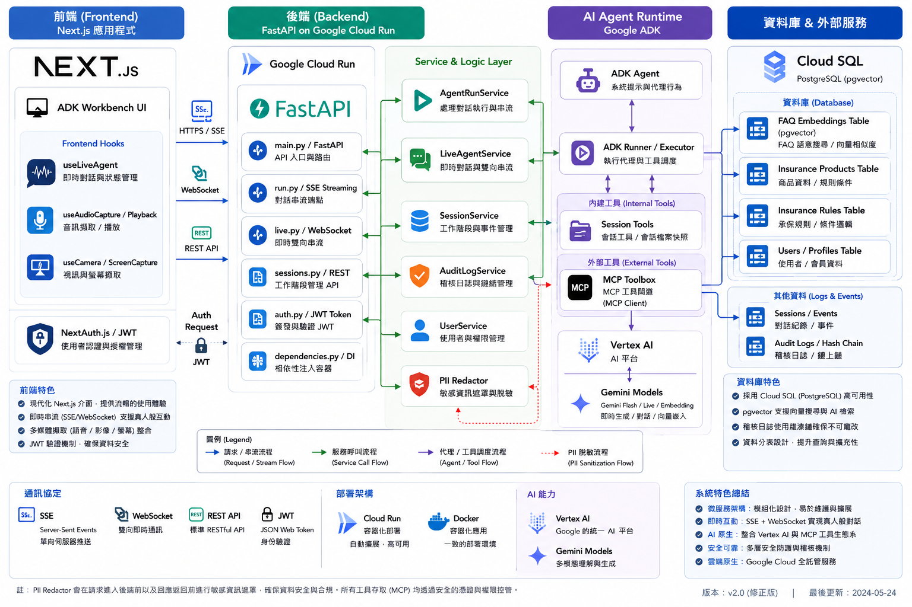
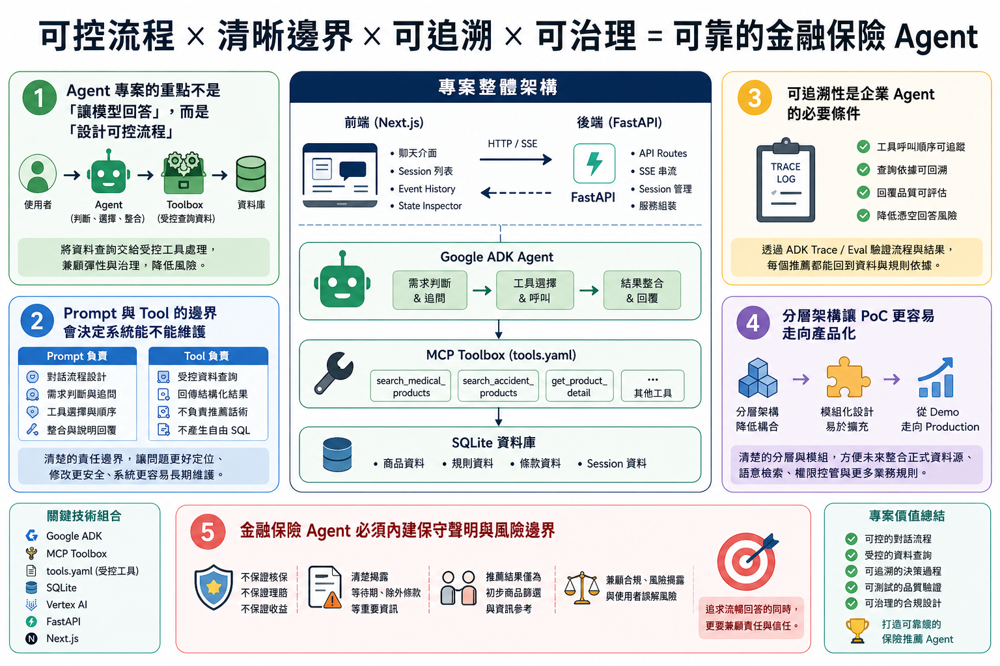

# 保險推薦 Agent

這是一個以 Google ADK 為核心的保險推薦 Agent 範例專案。系統整合 FastAPI、Next.js、MCP Toolbox、PostgreSQL/pgvector 與 Gemini/Vertex AI，示範如何建立具備產品查詢、FAQ 語意搜尋、會話記憶、稽核紀錄、PII 保護，以及即時語音/影像互動能力的 AI Agent。

👉 **線上展示專案：[https://lastingyeh.github.io/adk-insurance-recommendation-agent/](https://lastingyeh.github.io/adk-insurance-recommendation-agent/)**

這份 README 的目標是讓使用者快速完成三件事：

1. 了解這個專案解決什麼問題。
2. 在本機把系統跑起來。
3. 知道要深入架構、測試或部署時該看哪些文件。

## 核心功能

- Google ADK Agent：理解保險需求、主動追問、查詢產品並產生推薦回覆。
- MCP Toolbox：透過受控 SQL 工具查詢保險產品、推薦規則與 FAQ 知識庫。
- FastAPI 後端：提供 REST API、SSE 串流回覆與 WebSocket 即時互動。
- Next.js 前端：提供保險推薦對話介面、Live mode 與 Agent 狀態視覺化。
- PostgreSQL + pgvector：儲存產品、FAQ、Session、Audit Log 與向量資料。
- Multimodal Live Agent：支援即時語音、畫面與互動式對話。
- 安全與合規設計：包含 JWT 驗證、PII redaction、public state filtering 與 audit hash chain。
- 評估驅動開發：使用 ADK evalsets 驗證推薦品質、安全性、session-aware 行為與 Live mode。
- 雲端部署準備：提供 Docker Compose、Cloud Run 與 Terraform dev/staging/prod 部署入口。

## 系統架構



```text
Frontend (Next.js)
    |
    | REST / SSE / WebSocket
    v
FastAPI Backend
    |
    +-- Google ADK Runner
    |       |
    |       +-- Insurance Agent
    |       +-- Session tools
    |       +-- MCP Toolbox tools
    |
    +-- Session Service
    +-- User Service
    +-- Audit Log Service
    +-- Live Agent Service
    |
    v
PostgreSQL / pgvector
    |
    +-- Insurance products
    +-- Recommendation rules
    +-- FAQ knowledge
    +-- Session state
    +-- Audit logs
```



## 技術組成

| 類別             | 技術                                 |
| ---------------- | ------------------------------------ |
| Agent 框架       | Google ADK                           |
| LLM / 多模態模型 | Gemini / Vertex AI                   |
| 後端 API         | FastAPI, Uvicorn                     |
| 前端             | Next.js 15, React 19, NextAuth.js    |
| 資料庫           | PostgreSQL, pgvector                 |
| 工具層           | MCP Toolbox for Databases            |
| 驗證             | JWT, NextAuth                        |
| 基礎設施         | Docker Compose, Cloud Run, Terraform |
| 測試與評估       | pytest, ADK eval, Locust             |
| 套件管理         | uv, npm                              |

## 專案目錄

```text
.
├── app/                         # 後端 Agent 與 FastAPI 應用程式
│   ├── api/                     # REST、SSE、WebSocket 路由與資料格式
│   ├── app_utils/               # Telemetry 與部署輔助工具
│   ├── prompts/                 # Agent system prompt
│   ├── security/                # 驗證、PII 保護與 public state filtering
│   ├── services/                # Agent 執行、Live mode、Session、User 與 Audit Log 服務
│   ├── streaming/               # WebSocket upstream/downstream 處理
│   ├── tools/                   # ADK session tools
│   ├── agent.py                 # Agent factory 與 ADK app 註冊
│   ├── config.py                # 執行時設定
│   └── container.py             # Dependency container
├── db/                          # 資料庫 schema、seed data 與 MCP Toolbox 設定
├── deployment/                  # Terraform 與部署文件
├── docs/                        # 架構與功能文件
├── frontend/                    # Next.js 前端應用程式
├── scripts/                     # 設定、資料建立與 FAQ ingestion 腳本
├── tests/                       # Unit、integration、security、API、load 與 eval 測試
├── docker-compose.yml           # 本機容器編排
├── Dockerfile.backend           # 後端容器映像設定
├── Dockerfile.toolbox           # Toolbox 容器映像設定
├── Makefile                     # 主要開發指令入口
├── pyproject.toml               # Python 專案設定與依賴
└── .env.example                 # 環境變數範本
```

## 前置需求

本機開發前請先安裝：

- Python 3.12
- uv
- Node.js 20 或更新版本
- npm
- Docker 與 Docker Compose
- Google Cloud credentials：使用 Vertex AI、embedding、雲端部署或 Toolbox 語意搜尋時需要

先建立本機環境設定檔：

```bash
cp .env.example .env
```

接著依照你的環境修改 `.env`。

## 快速開始

### 方式一：使用 Docker Compose 啟動

如果你想一次啟動資料庫、Toolbox、後端與前端，建議使用這個方式。

```bash
cp .env.example .env
make up-build
```

啟動後可開啟：

```text
前端介面：http://localhost:3000
後端 API：http://localhost:8080
健康檢查：http://localhost:8080/healthz
就緒檢查：http://localhost:8080/readyz
```

停止服務：

```bash
make down
```

查看服務紀錄：

```bash
make logs
```

### 方式二：分開啟動服務

如果你正在開發後端或前端，建議用這個方式。

```bash
cp .env.example .env
make install-all
make db-up
make db-seed
make db-ingest
```

啟動後端：

```bash
make run-fastapi
```

在另一個終端機啟動前端：

```bash
make ui-install
make ui-dev
```

開啟：

```text
前端介面：http://localhost:3000
後端 API：http://localhost:8080
```

## 環境變數

應用程式會從環境變數讀取執行設定。請以 `.env.example` 為範本。

| 變數                             | 用途                                                      |
| -------------------------------- | --------------------------------------------------------- |
| `GOOGLE_GENAI_USE_VERTEXAI`      | 設為 `1` 時使用 Vertex AI。                               |
| `GOOGLE_CLOUD_PROJECT`           | Google Cloud project ID。                                 |
| `GOOGLE_CLOUD_LOCATION`          | Google Cloud region，例如 `us-central1`。                 |
| `GOOGLE_API_KEY`                 | 本機使用 API key 模式時的 Google GenAI API key。          |
| `GOOGLE_APPLICATION_CREDENTIALS` | 需要 service account 時使用的憑證檔案路徑。               |
| `ADK_APP_NAME`                   | ADK application name，預設為 `app`。                      |
| `DATABASE_URL`                   | 容器或部署環境使用的主要資料庫 URL。                      |
| `ADK_SESSION_DB_URI`             | ADK Session service 使用的資料庫 URL。                    |
| `ADK_MEMORY_MODE`                | 設為 `in_memory` 可使用非持久化 session；預設使用資料庫。 |
| `MODEL_NAME`                     | 文字推薦模型，預設為 `gemini-2.5-flash`。                 |
| `LIVE_MODEL_NAME`                | WebSocket Live mode 使用的多模態模型。                    |
| `TOOLBOX_SERVER_URL`             | MCP Toolbox server URL。                                  |
| `JWT_SECRET`                     | 後端 JWT signing secret；正式環境請使用高強度值。         |
| `NEXTAUTH_SECRET`                | 前端 NextAuth secret；正式環境請使用高強度值。            |
| `AUDIT_LOG_ENABLED`              | 設為 `1` 時啟用 audit logging。                           |
| `AUDIT_DB_PATH`                  | Audit log 使用的資料庫 URL。                              |
| `AUDIT_HASH_SALT`                | Audit hash chain 與敏感資料雜湊使用的 salt。              |
| `PII_REDACTION_ENABLED`          | 設為 `1` 時啟用 PII redaction。                           |
| `ENABLE_CLOUD_TRACING`           | 啟用後將 trace 傳送到 Google Cloud Trace。                |
| `ENABLE_CLOUD_LOGGING`           | 啟用後將 log 傳送到 Google Cloud Logging。                |
| `BQ_ANALYTICS_DATASET`           | 設定後啟用 BigQuery Agent Analytics plugin。              |

## 常用開發指令

大部分常見工作都可以透過 Makefile 執行。

| 指令               | 說明                                                  |
| ------------------ | ----------------------------------------------------- |
| `make help`        | 顯示可用指令。                                        |
| `make install`     | 建立 Python 3.12 virtual environment 並安裝核心依賴。 |
| `make install-all` | 安裝核心、dev、eval 與 GCP 依賴。                     |
| `make sync`        | 同步 Python 依賴。                                    |
| `make env-check`   | 檢查本機工具與環境設定。                              |
| `make db-up`       | 啟動本機 PostgreSQL 與 MCP Toolbox 容器。             |
| `make db-setup`    | 啟動資料庫、建立測試使用者並匯入 FAQ embeddings。     |
| `make run-fastapi` | 在 port 8080 啟動 FastAPI 後端。                      |
| `make ui-install`  | 安裝前端依賴。                                        |
| `make ui-dev`      | 在 port 3000 啟動 Next.js 前端。                      |
| `make up`          | 啟動所有 Docker Compose 服務。                        |
| `make up-build`    | 重新建置並啟動所有 Docker Compose 服務。              |
| `make down`        | 停止 Docker Compose 服務。                            |
| `make logs`        | 追蹤 Docker Compose logs。                            |
| `make clean`       | 清除 Python cache 與 pytest cache。                   |
| `make clean-all`   | 清除產生的 cache 與本機 virtual environment。         |

## API 概覽

後端提供健康檢查、驗證、Session 管理、Agent SSE 串流與 Live Agent WebSocket API。

| 方法     | 路徑                                                     | 用途                                         |
| -------- | -------------------------------------------------------- | -------------------------------------------- |
| `GET`    | `/healthz`                                               | 基本健康檢查。                               |
| `GET`    | `/readyz`                                                | 檢查 Session store、Toolbox 等依賴是否就緒。 |
| `POST`   | `/auth/token`                                            | 登入並取得 JWT access token。                |
| `POST`   | `/api/agent/run`                                         | 執行 Agent，並透過 SSE 回傳串流結果。        |
| `GET`    | `/apps/{app_name}/users/{user_id}/sessions`              | 列出使用者 sessions。                        |
| `POST`   | `/apps/{app_name}/users/{user_id}/sessions`              | 建立或初始化 session。                       |
| `GET`    | `/apps/{app_name}/users/{user_id}/sessions/{session_id}` | 取得指定 session。                           |
| `DELETE` | `/apps/{app_name}/users/{user_id}/sessions/{session_id}` | 刪除指定 session。                           |
| `WS`     | `/api/agent/live/ws/{session_id}`                        | 啟動多模態 Live Agent session。              |

使用者、Session 與 Agent endpoint 都需要驗證。前端會透過 `/auth/token` 取得 token，並在後續請求中轉送給後端。

## 前端

前端位於 `frontend/`，使用 Next.js 與 NextAuth。

常用指令：

```bash
make ui-install
make ui-dev
make ui-build
```

重要目錄：

- `frontend/app/`：頁面路由與 API proxy routes。
- `frontend/components/`：主要 UI 元件，包含 user mode、workbench、waveform、state tree 與 timeline views。
- `frontend/hooks/`：audio、camera、screen capture 與 Live Agent hooks。
- `frontend/lib/`：proxy、markdown、mock data、session storage 與 auth recovery helpers。

## 資料庫與 MCP Toolbox

資料庫相關檔案位於 `db/`。

| 檔案                  | 用途                                          |
| --------------------- | --------------------------------------------- |
| `db/schema.sql`       | 產品、推薦規則、FAQ 與向量資料的主要 schema。 |
| `db/audit_schema.sql` | Audit log schema。                            |
| `db/seed.sql`         | 本機開發使用的 seed data。                    |
| `db/tools.local.yaml` | 本機 MCP Toolbox tool definitions。           |
| `db/tools.cloud.yaml` | 雲端 MCP Toolbox tool definitions。           |

MCP Toolbox 提供的受控工具包含：

- `search_medical_products`
- `search_accident_products`
- `search_family_protection_products`
- `search_income_protection_products`
- `get_product_detail`
- `get_recommendation_rules`
- `search_faq`

匯入 FAQ embeddings：

```bash
make db-ingest
```

## 安全與合規

專案包含以下安全與合規設計：

- 使用 JWT 驗證後端 API 存取。
- 在受保護 endpoint 檢查 user/session ownership。
- 透過 `app/security/pii.py` 進行 PII redaction。
- 使用 public state filtering，避免敏感 session data 外洩到前端。
- 透過 `app/services/audit_log_service.py` 記錄 audit logs。
- 支援 audit hash chain，讓稽核紀錄具備防竄改檢查能力。
- 可設定 audit retention 與 hashing salt。

正式環境請務必替換本機範例 secret：

```text
JWT_SECRET
NEXTAUTH_SECRET
AUDIT_HASH_SALT
DATABASE_URL
AUDIT_DB_PATH
```

不要提交 `.env`、service account key 或任何產生的 secret 檔案。

## 測試

執行完整 Python 測試：

```bash
make check
```

執行特定測試群組：

```bash
make test-api
make test-security
make test-audit
```

測試涵蓋 unit、integration、API、security、load 與 eval，主要位於 `tests/`。

## 評估

ADK evalsets 位於 `tests/eval/evalsets/`。

執行預設評估：

```bash
make eval
```

執行所有評估：

```bash
make eval-all
```

執行特定評估群組：

```bash
make eval-core
make eval-extended
make eval-safety
make eval-session-aware
make eval-live
```

評估範圍包含核心推薦、延伸情境、安全行為、session-aware memory 與 Live mode 互動。

## 部署

部署相關檔案位於 `deployment/`。

| 路徑                                                 | 用途                                          |
| ---------------------------------------------------- | --------------------------------------------- |
| `deployment/docs/`                                   | 部署、CI/CD 與環境文件。                      |
| `deployment/terraform/bootstrap/`                    | GitHub / Cloud Build 等 bootstrap resources。 |
| `deployment/terraform/dev/`                          | Dev environment Terraform。                   |
| `deployment/terraform/staging/`                      | Staging environment Terraform。               |
| `deployment/terraform/prod/`                         | Production environment Terraform。            |
| `deployment/terraform/modules/agent_infrastructure/` | 共用 infrastructure module。                  |

常用部署指令：

```bash
make tf-gen-config
make tf-plan ENV_NAME=dev
make tf-apply ENV_NAME=dev
make build-push
make gcp-deploy ENV_NAME=dev
```

部署前，請在 `.env` 設定必要的 GCP 變數：

```text
GOOGLE_CLOUD_PROJECT
GOOGLE_CLOUD_LOCATION
ARTIFACT_REPOSITORY
ENV_NAME
GITHUB_OWNER
GITHUB_REPO_NAME
```

## 常見問題

### 缺少 `.env`

從範本建立：

```bash
cp .env.example .env
```

### 後端尚未就緒

檢查：

```text
http://localhost:8080/readyz
```

如果 readiness check 失敗，確認 PostgreSQL 與 MCP Toolbox 已啟動：

```bash
make db-up
make toolbox-logs
```

### 前端連不到後端

檢查以下變數：

```text
NEXT_PUBLIC_API_URL
FASTAPI_BASE_URL
FASTAPI_BASE_URL_DOCKER
NEXTAUTH_URL
```

本機瀏覽器通常使用：

```text
http://localhost:8080
```

### 登入或驗證失敗

先確認測試使用者已建立：

```bash
make db-seed
```

也請確認 `JWT_SECRET` 與 `NEXTAUTH_SECRET` 在後端與前端設定一致。

### FAQ 語意搜尋失敗

確認 Google credentials 已設定，並且 FAQ embeddings 已匯入：

```bash
make db-ingest
```

### Port 已被占用

預設 port 如下：

```text
前端：3000
後端：8080
Toolbox：5001
PostgreSQL：5432
```

請停止占用服務，或在 `.env` 中調整對應 port 變數。

## 文件索引

- 後端架構：`docs/features/backend-agent-design.md`
- 前端設計：`docs/features/frontend.md`
- 即時串流架構：`docs/features/live-streaming-architecture.md`
- MCP Toolbox 與資料庫工具：`docs/features/mcp-toolboxs.md`
- Observability：`docs/features/obs.md`
- Evaluation：`docs/features/evaluation.md`
- Testing：`docs/features/testing.md`
- 部署指南：`deployment/docs/README.md`
- 開發與部署計畫：`deployment/docs/plan.md`
- CI/CD 說明：`deployment/docs/cicd.md`
- Workload Identity Federation 設定：`deployment/docs/wif-setup.md`

## 貢獻方式

提交變更前，建議先執行：

```bash
make check
make test-security
make eval
```

程式品質檢查：

```bash
make lint
```

如果修改 Agent 行為，請同步新增或更新 `tests/eval/evalsets/` 中的 evalset，讓推薦品質與安全行為可以被持續驗證。

## 授權

可自由使用、修改與散布程式碼，但若分享完整程式碼請註明出處喔 ^^。

## 免責聲明

本專案僅用於原型設計、AI 技術展示、學術研究與雲端系統架構示範。所有保險推薦結果、規則、商品條款與保費計算皆為虛構 or 僅供初步參考，**不可直接用於真實金融或保險業務**。實際投保與保險諮詢仍需以保險公司官方商品說明、要保書、健康告知書與保險公司核保結果為準。
