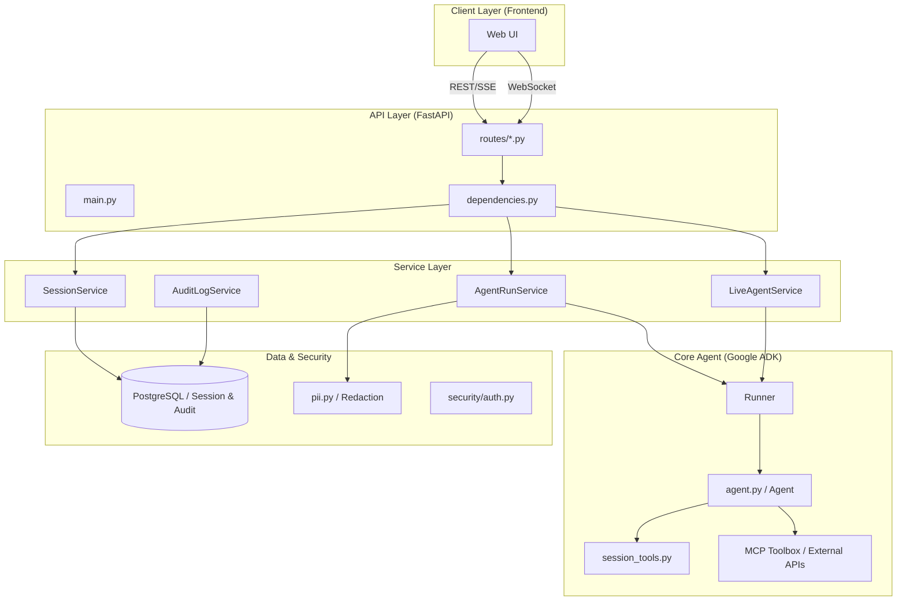

# 保險推薦代理人應用程式核心 (App Core)

本目錄包含保險推薦代理人的後端核心邏輯，基於 **Google ADK (Agent Developer Kit)** 與 **FastAPI** 建構。

---

## 1. 完整目錄架構

```text
app/
├── api/                    # API 介面層
│   ├── routes/             # API 路由實作 (REST & WebSocket)
│   │   ├── auth.py         # 認證路由 (JWT)
│   │   ├── live.py         # Gemini Live WebSocket 路由
│   │   ├── run.py          # Agent 執行 (SSE Streaming) 路由
│   │   └── sessions.py     # 會話管理路由
│   ├── dependencies.py     # FastAPI 相依性注入 (Container, Auth)
│   ├── main.py             # FastAPI 應用程式進入點與生命週期
│   └── schemas.py          # Pydantic 資料模型 (Request/Response)
├── app_utils/              # 輔助工具
│   ├── deploy.py           # Vertex AI Agent Engine 部署腳本
│   ├── telemetry.py        # OpenTelemetry 與 GCS 日誌配置
│   └── typing.py           # 共通型別定義 (如 Feedback)
├── prompts/                # 提示詞管理
│   └── insurance_agent_prompt.txt # 代理人核心系統指令 (System Instruction)
├── security/               # 安全與隱私
│   ├── auth.py             # 密碼雜湊與 JWT 簽發邏輯
│   └── pii.py              # PII (個人隱私資訊) 遮蔽與過濾
├── services/               # 業務邏輯服務層 (Service Layer)
│   ├── agent_run_service.py  # 封裝 ADK Runner 與事件轉換 (SSE)
│   ├── audit_log_service.py  # 審計日誌持久化 (PostgreSQL)
│   ├── live_agent_service.py # 管理 Gemini Live 雙向串流任務
│   ├── readiness_service.py  # 系統就緒與健康檢查
│   ├── session_service.py    # 會話狀態管理與持久化
│   └── user_service.py       # 使用者資料庫操作
├── tools/                  # 代理人工具集 (Agent Tools)
│   └── session_tools.py    # 供 Agent 調用的狀態管理工具 (Snapshot/Save)
├── agent.py                # ADK Agent 與 Toolbox 配置
├── agent_engine_app.py     # Vertex AI Agent Engine 封裝
├── config.py               # 環境變數與執行階段配置
├── container.py            # 相依性注入容器 (Dependency Injection)
├── session_state.py        # 會話狀態鍵名定義 (State Schema)
└── __init__.py             # 模組初始化與警告過濾
```

---

## 2. 系統設計架構圖

系統採用分層架構，確保開發、測試與維護的解耦。



---

## 3. 服務層詳細說明 (Service Layer)

| 服務名稱 | 完整說明 | 關鍵特色 |
| :--- | :--- | :--- |
| **AgentRunService** | 負責與 ADK Runner 互動，管理標準 Agent 的執行週期與串流輸出。 | 支援 SSE 流式回應、ADK 事件轉前端 Envelope、自動累積對話文字、整合審計日誌。 |
| **SessionService** | 負責對話會話 (Session) 的生命週期管理與狀態持久化。 | 支援會話清單讀取、狀態同步更新 (State Patch)、UI 友善的相對時間格式化、PII 公開狀態過濾。 |
| **LiveAgentService** | 管理 Gemini Live (Multimodal Live API) 的雙向串流會話。 | 配置雙向音訊/轉錄參數、協調 WebSocket 上下游任務 (Upstream/Downstream)、支援主動發話配置。 |
| **AuditLogService** | 實作具備安全保護的審計日誌系統。 | 整合 PII 自動遮蔽、支援雜湊鏈 (Hash Chain) 確保完整性、異步寫入 PostgreSQL、自動過期清理。 |
| **ReadinessService** | 執行系統就緒檢查 (Readiness Check)。 | 併發檢測資料庫連線與遠端 MCP Toolbox Server 可用性，提供診斷錯誤清單。 |
| **UserService** | 提供使用者帳戶資料存取。 | 支援從資料庫檢索使用者資訊，供 JWT 認證機制比對身分。 |

---

## 4. 重點特色與程式碼摘錄

### A. 相依性注入與容器化 (`container.py`)
使用 `AppContainer` 集中管理所有單例服務，方便 API 層透過 FastAPI `Depends` 獲取。

```python
@dataclass(frozen=True)
class AppContainer:
    config: AppRuntimeConfig
    agent: Agent
    runner: Runner
    sessions: SessionService
    agent_runs: AgentRunService
    live_agent: LiveAgentService
    # ...
```

### B. 事件流轉換與 SSE 封裝 (`services/agent_run_service.py`)
將 ADK 的原始 `Event` 轉換為前端可識別的 `Envelope`（包含 `timeline`, `message`, `state`）。

```python
def map_adk_event_to_envelopes(event: Event, sequence: int) -> list[dict[str, object]]:
    # 區分業務工具與內部狀態工具，動態產生 timeline 事件
    # 處理文字串流並過濾重複的 user echo
    if text_parts and event.author != "user":
        envelopes.append({"type": "message", "text": full_text, "mode": "append"})
    # ...
```

### C. 隱私資訊保護 (`security/pii.py`)
自動偵測並遮蔽電子郵件、台灣身分證字號與信用卡號，確保日誌不洩露敏感資料。

```python
EMAIL_RE = re.compile(r"\b[A-Z0-9._%+-]+@[A-Z0-9.-]+\.[A-Z]{2,}\b", re.I)
TAIWAN_ID_RE = re.compile(r"\b[A-Z][12]\d{8}\b", re.I)

def redact_text(text: str) -> tuple[str, list[PiiFinding]]:
    # regex 替換與計數
    return redacted, findings
```

### D. 會話感知工具 (`tools/session_tools.py`)
讓 AI 代理人具備自省與記憶能力，能將對話中獲取的條件存回資料庫。

```python
def save_user_profile(age: int, budget: int, tool_context: ToolContext):
    # 將 Agent 識別到的參數寫入 ADK ToolContext.state
    tool_context.state["user:age"] = age
    tool_context.state["user:budget"] = budget
```

---

## 5. 系統呼叫流程 (以 API /run 為例)

以下描述使用者發送一個提示詞後的後端處理鏈：

1.  **進入點 (`api/routes/run.py`)**: 接收 `POST /api/agent/run` 請求，解析 `prompt` 與 `sessionId`。
2.  **認證與容器獲取 (`api/dependencies.py`)**:
    *   `get_current_user`: 驗證 JWT Token 獲取 `UserInDB`。
    *   `get_container`: 獲取 `AppContainer` 實例。
3.  **服務啟動 (`services/agent_run_service.py`)**:
    *   呼叫 `stream()` 方法。
    *   `ensure_session`: 確認資料庫中有此會話，並載入既有狀態。
4.  **ADK 執行器 (`google.adk.runners.Runner`)**:
    *   呼叫 `run_async()`。
    *   **Agent 思維鏈**:
        1.  讀取 `insurance_agent_prompt.txt`。
        2.  判斷是否需要呼叫 `get_user_profile_snapshot` (來自 `session_tools.py`)。
        3.  根據需求呼叫 **MCP Toolbox** 搜尋保險產品。
        4.  產出文字回覆或更新 `state`。
5.  **事件封裝與日誌 (`AgentRunService`)**:
    *   `map_adk_event_to_envelopes`: 將 ADK 事件轉為 JSON 封包。
    *   `AuditLogService.record`: 同步記錄審計日誌 (PII 已遮蔽)。
6.  **串流回傳**: FastAPI 以 `StreamingResponse (SSE)` 格式逐行將封包推送到前端。
7.  **結束**: 發送 `type: done` 封包，包含最終文字與完整更新後的 `state`。
