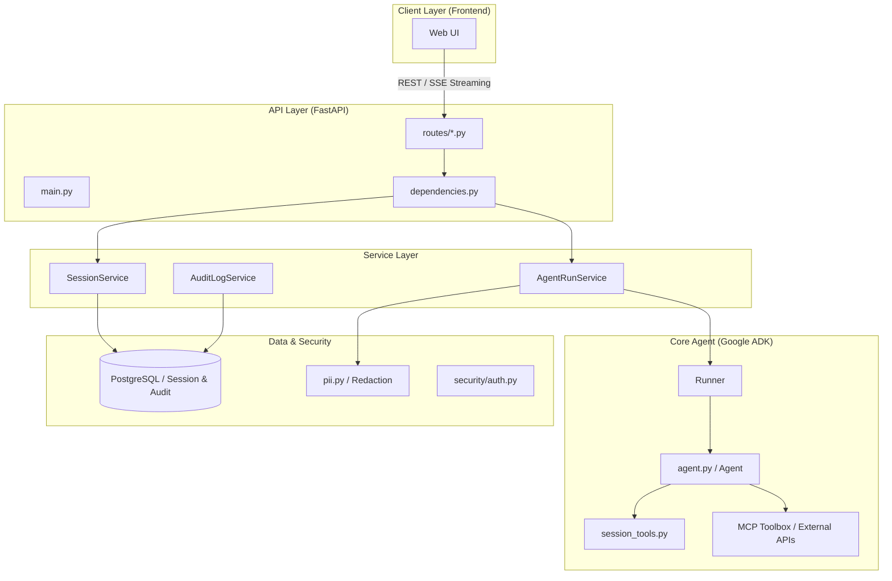
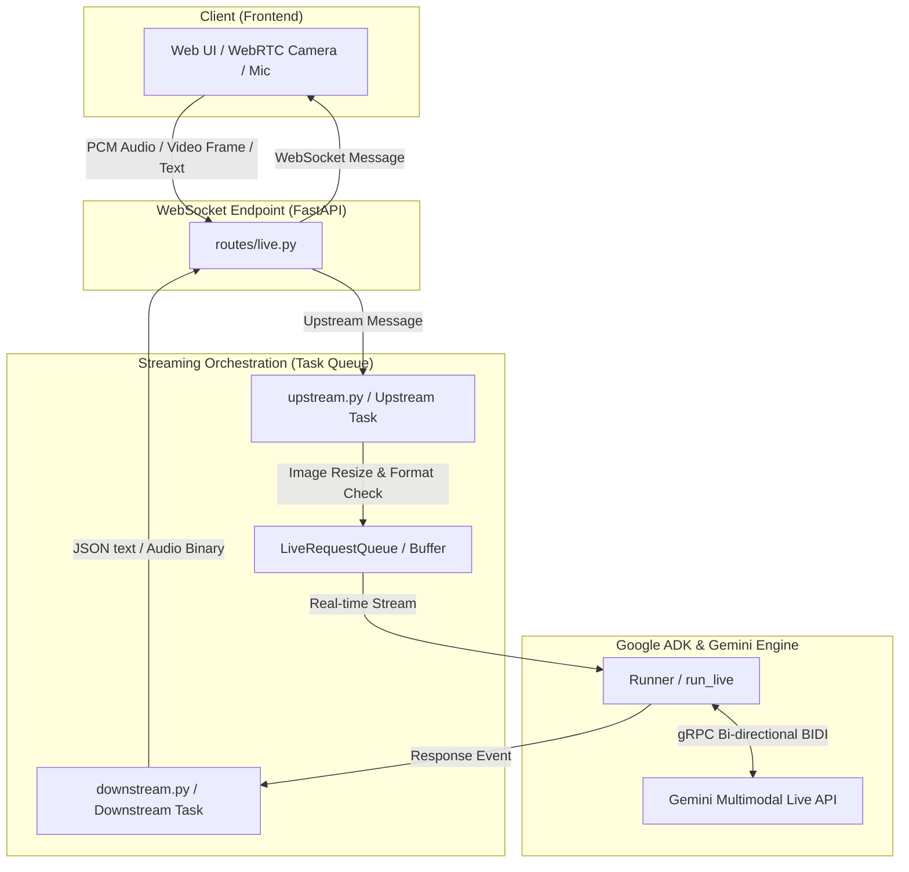

# 保險推薦代理人應用程式核心 (App Core)

本目錄包含保險推薦代理人的後端核心邏輯，基於 **Google ADK (Agent Developer Kit)**、**FastAPI** 與 **Gemini Multi-Modal Live API** 建構。

---

## 1. 完整目錄架構

```text
app/
├── api/                    # API 介面層
│   ├── routes/             # API 路由實作 (REST & WebSocket)
│   │   ├── auth.py         # 認證路由 (JWT 簽發與登入驗證)
│   │   ├── live.py         # Gemini Live WebSocket 路由 (雙向即時音訊與影像)
│   │   ├── run.py          # Agent 執行 (標準文字對話與 SSE Streaming) 路由
│   │   └── sessions.py     # 會話管理路由 (對話歷史 CRUD)
│   ├── dependencies.py     # FastAPI 相依性注入 (AppContainer 獲取、JWT 用戶校驗)
│   ├── main.py             # FastAPI 應用程式進入點、CORS、就緒/健康檢查與生命周期
│   └── schemas.py          # Pydantic 資料傳輸物件 (DTO) 模型
├── app_utils/              # 輔助與部署工具
│   ├── deploy.py           # Vertex AI Agent Engine 部署腳本 (CLI 工具)
│   ├── telemetry.py        # OpenTelemetry、Cloud Tracing 與 GCS 日誌配置
│   └── typing.py           # 共通型別定義 (如使用者回饋 Feedback 結構)
├── prompts/                # 提示詞管理
│   └── insurance_agent_prompt.txt # 代理人核心系統指令 (System Instruction)
├── security/               # 安全、密碼與隱私
│   ├── auth.py             # 密碼 Bcrypt 雜湊與 JWT 簽發/校驗邏輯
│   └── pii.py              # PII (敏感隱私資訊) 正則偵測與自動遮蔽/雜湊工具
├── services/               # 業務邏輯服務層 (Service Layer)
│   ├── agent_run_service.py  # 封裝 ADK Runner、文字串流、事件轉前端 Envelope 與稽核記錄
│   ├── audit_log_service.py  # 具備防篡改防洩漏設計的審計日誌系統 (PostgreSQL)
│   ├── live_agent_service.py # 管理 Gemini Live 雙向串流任務 (Bidi-streaming)
│   ├── readiness_service.py  # 系統就緒與外部相依性健康檢查 (DB, MCP)
│   ├── session_service.py    # 會話生命週期管理、相對時間格式化、PII 狀態過濾與狀態補丁 (Patch)
│   └── user_service.py       # 使用者帳戶資料庫存取服務
├── streaming/              # Gemini Live 即時串流管道 (Pipeline)
│   ├── downstream.py       # 下游任務 (Downstream Task)：自 Agent 讀取影音與轉錄資料轉發給客戶端
│   └── upstream.py         # 上遊任務 (Upstream Task)：將客戶端 PCM 語音、文字與優化後的影像幀發送至 Agent
├── tools/                  # 代理人工具集 (Agent Tools)
│   └── session_tools.py    # 供 Agent 調用的狀態管理工具 (Snapshot, Save, Clear)
├── agent.py                # ADK Agent 與 Toolbox (MCP) 整合配置
├── agent_engine_app.py     # Vertex AI Agent Engine 相容進入點與 Feedback 註冊
├── config.py               # 強型別環境變數與執行階段配置 (AppRuntimeConfig)
├── container.py            # 相依性注入容器 (AppContainer) 集中組裝點
├── session_state.py        # 追蹤的 Session 狀態鍵名 (State Schema)
└── __init__.py             # 模組初始化、導出與 Deprecation 警告過濾
```

---

## 2. 系統設計架構圖

本系統採用清晰的分層架構，確保開發、測試、安全稽核與維護的解耦。

### A. 標準 REST / SSE API 架構


### B. Gemini Multimodal Live (WebSocket) 雙向串流架構


---

## 3. 服務層詳細說明 (Service Layer)

| 服務名稱 | 完整說明 | 關鍵特色 |
| :--- | :--- | :--- |
| **AgentRunService** | 負責與標準 ADK Runner 互動，管理執行週期與串流輸出。 | 支援 SSE 流式回應、ADK 事件轉前端 Envelope、過濾 user echo、安全整合防篡改審計日誌。 |
| **SessionService** | 負責對話會話 (Session) 的生命週期與狀態持久化。 | 支援會話清單讀取、狀態同步 (State Patch)、UI 相對時間格式化、PII 公開狀態過濾。 |
| **LiveAgentService** | 管理 Gemini Live (Multimodal Live API) 的雙向串流對話。 | 配置雙向音訊/轉錄參數 (RunConfig)、協調非同步上下游任務 (Upstream/Downstream)、支援主動發話配置。 |
| **AuditLogService** | 實作具備安全保護與防篡改的審計日誌系統。 | 整合 PII 自動遮蔽、**雜湊鏈 (Hash Chain) 確保完整性**、異步寫入 PostgreSQL、自動過期清理。 |
| **ReadinessService** | 執行系統就緒檢查 (Readiness Check)。 | 使用 `asyncio.to_thread` 併發檢測資料庫連線與遠端 MCP Toolbox Server 可用性，避免阻塞。 |
| **UserService** | 提供使用者帳戶資料存取與建立。 | 支援從 PostgreSQL 檢索使用者資訊，供 JWT 認證機制比對明文密碼 Bcrypt 雜湊。 |

---

## 4. 重點特色與程式碼摘錄

### A. 相依性注入與容器化 (`container.py`)
使用 `AppContainer` 集中管理所有服務與執行期設定，並透過 FastAPI `Depends` 獲取單例。

```python
@dataclass(frozen=True)
class AppContainer:
    config: AppRuntimeConfig
    agent: Agent
    session_store: BaseSessionService
    runner: Runner
    sessions: SessionService
    users: UserService
    agent_runs: AgentRunService
    live_agent: LiveAgentService
    readiness: ReadinessService
    audit_logs: AuditLogService
```

### B. 事件流轉換與 SSE 封裝 (`services/agent_run_service.py`)
將 ADK 的原始 `Event` 轉換為前端可識別的 `Envelope`（包含 `timeline`, `message`, `state`），並即時記錄審計：

```python
def map_adk_event_to_envelopes(event: Event, sequence: int) -> list[dict[str, object]]:
    # 區分業務工具與內部狀態工具，動態產生 timeline 事件
    # 處理文字串流並過濾重複的 user echo
    if text_parts and event.author != "user":
        envelopes.append({"type": "message", "text": full_text, "mode": "append"})
    # ...
```

### C. 隱私資訊保護 (`security/pii.py`)
自動偵測並遮蔽電子郵件、台灣身分證字號、信用卡號與電話，並過濾未經允許的 State 狀態欄位洩漏：

```python
EMAIL_RE = re.compile(r"\b[A-Z0-9._%+-]+@[A-Z0-9.-]+\.[A-Z]{2,}\b", re.I)
TAIWAN_ID_RE = re.compile(r"\b[A-Z][12]\d{8}\b", re.I)

def redact_text(text: str) -> tuple[str, list[PiiFinding]]:
    # regex 替換與計數，確保日誌/快照不洩露敏感資料
    return redacted, findings
```

### D. 會話感知工具 (`tools/session_tools.py`)
讓 AI 代理人具備自省與記憶能力，能將對話中獲取的關鍵數據儲存回 ADK 的 `ToolContext.state` 並同步至持久化層：

```python
def save_user_profile(age: int, budget: int, tool_context: ToolContext):
    # 將 Agent 識別到的參數寫入 ADK ToolContext.state
    tool_context.state["user:age"] = age
    tool_context.state["user:budget"] = budget
```

### E. Gemini Multimodal Live API 雙向串流管道 (`streaming/`)
系統透過 WebSocket 實現高低延遲的多模態交互，包含音訊 PCM 二進位傳輸以及智慧型影格優化。

*   **影格自動縮放優化 (`streaming/upstream.py`)**：為了提升 Multimodal Live API 的穩定性，避免過大圖片造成處理延遲或 `1007 Dimension Mismatch` 錯誤，上游任務會自動將高解析度圖片或攝影機/螢幕影格等比例縮放至長邊 1024 像素內，並統一轉為 RGB JPEG 格式：
    ```python
    def _resize_image_if_needed(image_bytes: bytes, max_size: int = 1024) -> bytes:
        img = Image.open(io.BytesIO(image_bytes))
        if img.mode != "RGB":
            img = img.convert("RGB")
        w, h = img.size
        if w > max_size or h > max_size:
            # 等比例縮放並使用 LANCZOS 演算法
            # ...
        return optimized_bytes
    ```
*   **非同步雙任務調度 (`services/live_agent_service.py`)**：使用協程併發管理 `upstream_task` 與 `downstream_task`，確保一端中斷時能立即釋放 gRPC 與 WebSocket 連線：
    ```python
    upstream = asyncio.create_task(upstream_task(websocket, live_request_queue))
    downstream = asyncio.create_task(downstream_task(websocket, self._runner, ...))
    done, pending = await asyncio.wait([upstream, downstream], return_when=asyncio.FIRST_EXCEPTION)
    ```

---

## 5. 安全稽核與防篡改雜湊鏈設計

為了符合保險推薦法規監管，`AuditLogService` 實作了防篡改的審計日誌。
1.  **PII 自動遮蔽**：所有存入審計資料庫的 input 與 output 負載，均在寫入前經由 `pii.py` 的遮蔽邏輯處理。
2.  **雜湊鏈鏈接 (Hash Chain)**：每一筆審計紀錄均會包含當前紀錄的內容摘要 `event_hash` 以及前一筆紀錄的雜湊 `prev_hash`：
    $$\text{event\_hash} = \text{SHA256}(\text{id} \parallel \text{event\_type} \parallel \text{redacted\_payload} \parallel \text{prev\_hash} \parallel \dots)$$
3.  **匿名雜湊保護**：敏感變數如 `session_id` 和 `user_id` 在寫入前會混合系統 `hash_salt` 進行高強度的 salted-SHA256 轉換，即使審計庫洩露，也無法直接與真實用戶關聯：
    ```python
    session_id_hash = stable_hash(context.session_id, salt=self._hash_salt)
    ```

---

## 6. 核心呼叫流程

### A. 標準 /run API 流程
1.  **請求入口 (`api/routes/run.py`)**: 接收 `POST /api/agent/run` 請求，解析提示詞與 `sessionId`。
2.  **認證與容器獲取 (`api/dependencies.py`)**: 驗證 JWT 簽名、解碼並檢索 `UserInDB`，取得全域容器。
3.  **會話初始化與同步 (`services/agent_run_service.py`)**: 透過 `ensure_session` 確認或初始化資料庫中的 Session 及初始狀態。
4.  **ADK 引擎執行 (`google.adk.runners.Runner`)**: 調用 `run_async` 開始迭代。
5.  **工具調用與決策**:
    *   Agent 載入系統提示詞，評估意圖，並決定是否使用 `get_user_profile_snapshot` 讀取狀態。
    *   視需求呼叫 **MCP Toolbox** 商品搜尋 API。
    *   呼叫 `save_user_profile` 更新狀態（這會在 ADK 內部拋出 `state_delta` 動作）。
6.  **事件封裝與 SSE 傳送**: 呼叫 `map_adk_event_to_envelopes`，將原始事件即時轉換並格式化為 JSON 封包，並透過 FastAPI `StreamingResponse` 逐行推送到前端，同時非同步寫入審計日誌（PII 已自動遮蔽）。
7.  **結束**: 傳送 `done` 封包，提供最終完整文字及最新狀態快照。

### B. WebSocket 即時 Live 對話流程
1.  **握手與 JWT 校驗 (`api/routes/live.py`)**: 客戶端向 `/ws/{session_id}` 發起 WebSocket 握手，攜帶 token。系統解碼並確認權限，成功後 `websocket.accept()`。
2.  **功能開關同步**: 將前端配置（如主動發話、同理心對話）通過 SessionService 更新至對話 Session 狀態。
3.  **雙向任務啟動**: 呼叫 `live_agent_service.execute_live_session()`。
4.  **上游語音/影格處理**: `upstream_task` 讀取音訊 bytes 或是影像畫面。若為圖片，先進行縮放與壓縮，隨後發送至 `LiveRequestQueue`。
5.  **模型雙向處理**: `Runner.run_live` 將佇列數據通過 gRPC Bidi 連線轉發至 Gemini Multimodal Live API，並同時接收模型吐出的音訊和轉錄文字。
6.  **下游音訊播放**: `downstream_task` 將模型返回的音訊封包、文字轉錄、工具請求等，轉換為前端可讀 JSON 或 Binary，經由 WebSocket 即時播放至使用者端。

---

## 7. 配置、開發與運行

### A. 關鍵環境變數設定
您可以將這些變數設定於根目錄的 `.env` 檔案中：

*   `DATABASE_URL` / `ADK_SESSION_DB_URI`: PostgreSQL 資料庫連線字串，用於儲存 Session 與使用者。
*   `AUDIT_DB_PATH`: 審計日誌資料庫連線字串。
*   `MODEL_NAME`: 一般對話使用的模型，建議預設為 `gemini-2.5-flash`。
*   `LIVE_MODEL_NAME`: WebSocket 即時對話使用的模型，預設為 `gemini-live-2.5-flash-preview-native-audio-09-2025`。
*   `TOOLBOX_SERVER_URL`: MCP 遠端工具箱伺服器 URL (提供保險商品資料)。
*   `JWT_SECRET`: JWT 簽章密鑰。
*   `PII_REDACTION_ENABLED`: 是否啟用 PII 遮蔽安全功能。

### B. 運行與測試

您可以透過專案根目錄的 `Makefile` 或手動使用 `uv` 執行以下指令：

```bash
# 本地啟動 FastAPI 後端服務 (綁定 8080 埠，支援自動熱重載)
uv run uvicorn app.api.main:app --host 127.0.0.1 --port 8080 --reload

# 執行單元與整合測試
uv run pytest tests/
```

### C. 部署至 Vertex AI Agent Engine

本專案相容於 GCP 的 **Vertex AI Agent Engine (AdkApp)**。您可以透過 `app_utils/deploy.py` CLI 腳本將代碼、依賴及設定檔打包上傳至 Vertex AI 控制台。

```bash
# 部署至 GCP (預設 entrypoint 設為 app.agent_engine_app:agent_engine)
uv run python app/app_utils/deploy.py \
  --project YOUR_GCP_PROJECT_ID \
  --location us-central1 \
  --display-name "insurance-recommendation-agent"
```
