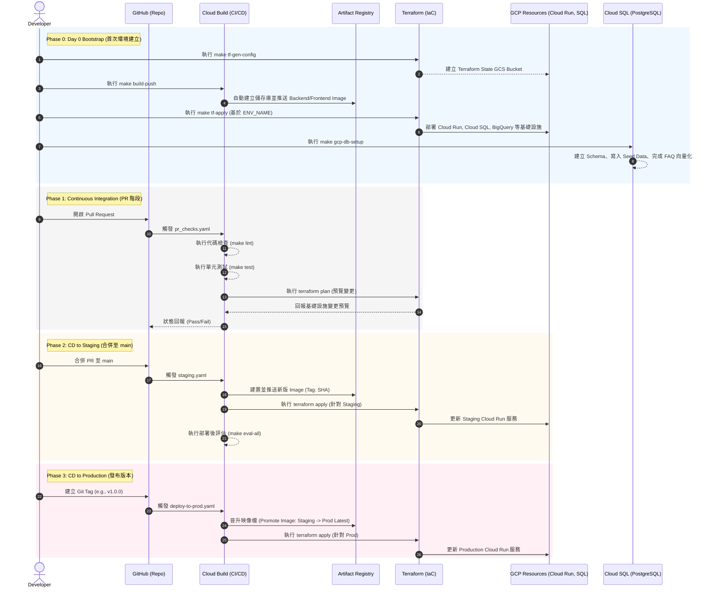

# 保險建議 Agent 部署架構總覽 (update)

本文件總結了保險建議 Agent (Insurance Recommendation Agent) 從本地開發到正式上線的完整部署生命週期，包含自動化流程時序圖與部署服務清單。

## 1. 端到端部署流程時序圖 (End-to-End Deployment Flow)

以下流程圖展示了從開發者提交程式碼，到自動化 CI/CD 流水線接手，最終完成 GCP 環境建置與資料庫初始化的完整過程。

## 2. 部署服務與架構清單 (Deployed Services Summary)

透過上述自動化流程與 Terraform，系統會在 GCP 環境中配置以下核心服務：

| 領域 (Domain) | 部署資源 / 服務名稱 | 說明與用途 |
| :--- | :--- | :--- |
| **運算 (Compute)** | Cloud Run (Backend) | 負責處理核心 Agent 邏輯與 API 請求。採用 **Sidecar 雙容器架構**，同時運行主程式與 Toolbox 容器。 |
| **運算 (Compute)** | Cloud Run (Frontend) | 運行獨立的 Next.js 前端應用程式，提供使用者互動介面。 |
| **資料庫 (Data)** | Cloud SQL (PostgreSQL 15) | 關聯式資料庫。負責儲存使用者資料、保險產品規則，以及透過 pgvector 擴充儲存 FAQ 知識庫的向量資料。 |
| **儲存 (Storage)** | Artifact Registry | Docker 映像檔的儲存庫。存放 Backend、Frontend 與 Toolbox 的容器映像檔。 |
| **儲存 (Storage)** | Cloud Storage (GCS) | 包含三個主要 Bucket： 1. Terraform State Bucket。 2. Telemetry Payload Bucket (存放完整 Prompt/Response 的 JSONL)。 3. Cloud Build Logs Bucket。 |
| **資安 (Security)** | Secret Manager | 安全儲存敏感資訊，包含資料庫密碼 (`insurance-agent-db-password-*`) 與外部 API Keys。 |
| **資安 (Security)** | IAM & WIF | 配置 Workload Identity Federation (WIF) 供 GitHub Actions/Cloud Build 無金鑰安全存取 GCP；並配置特定的 Service Accounts 遵循最小權限原則。 |
| **遙測與監控 (Telemetry)**| Cloud Logging | 負責收集應用程式運行的日誌與 Agent 呼叫的 Metadata (延遲、Token 消耗等)。 |
| **遙測與監控 (Telemetry)**| BigQuery | 分析中樞。包含 Linked Dataset (直接查詢 Logging) 以及外部資料表 (查詢 GCS JSONL)，並透過 `completions_view` 進行資料整併與分析。 |

> **開發工具提示**：若在學習過程中頻繁建置/刪除導致產生多餘的孤兒資料庫實體，可使用 `make gcp-cleanup-orphans` 指令協助列出與清理。