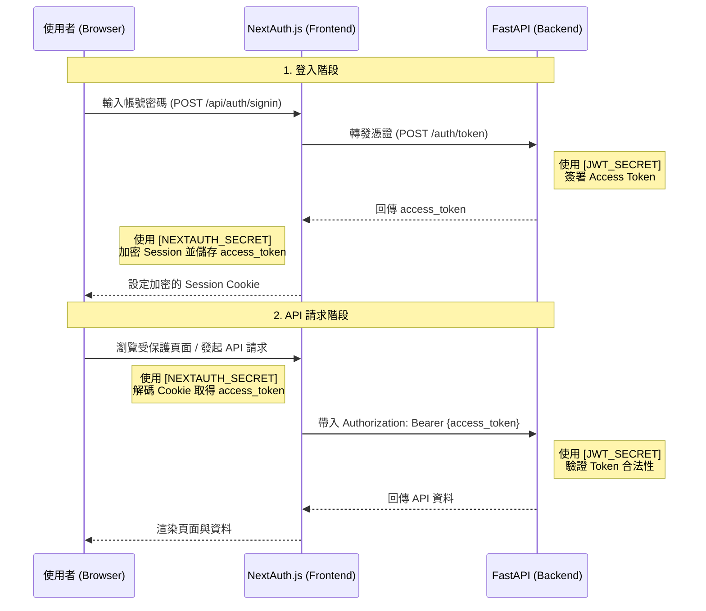

# 後端與 Agent 設計 (Backend & Agent Design)

本文件詳細說明 AI Agent 專案中的後端架構與 Agent 核心設計，涵蓋安全性、狀態管理及即時互動功能。

## 1. 核心框架：Google ADK
- **Agent 定義**：使用 `google-adk` 框架建構。Agent 實例化於 `app/agent.py`，配置有系統提示詞 (`prompts/insurance_agent_prompt.txt`)、工具集與生成參數。
- **應用實作**：使用 `google.adk.apps.App` 封裝 Agent，支援外掛擴充（如分析外掛）。
- **非同步支援**：全後端採用 `asyncio` 與 `FastAPI`，確保高併發下的效能。

## 2. 身份驗證與授權 (Auth)
- **機制**：使用 JWT (JSON Web Tokens) 進行 API 身份驗證，支援 OAuth2 密碼模式。
- **整合**：後端透過 `app/security/auth.py` 處理 Token 的簽發與驗證。
- **多端一致**：WebSocket (Live) 透過 Query Parameter 傳遞 Token，REST API 透過 Header 傳遞，共享相同的驗證邏輯。

### 前後端驗證密鑰關係 (Secrets Analysis)

| 變數名稱 | 所屬組件 | 主要功能 | 保護對象 |
| :--- | :--- | :--- | :--- |
| `NEXTAUTH_SECRET` | Frontend (Next.js) | 加密 Session Cookie & 簽署內部 JWT | 瀏覽器與前端之間的會話安全 |
| `JWT_SECRET` | Backend (FastAPI) | 簽署與驗證 API Access Token | 前端與後端 API 之間的通訊安全 |

*   **NEXTAUTH_SECRET (前端專用)**：由 NextAuth.js 使用，確保即使攻擊者拿到 Cookie，沒有此密鑰也無法解密其中的內容。配置於 `frontend/.env.local`，影響 `frontend/app/api/auth/[...nextauth]/route.ts` 與 Middleware。
*   **JWT_SECRET (後端專用)**：由 FastAPI 使用。後端是 Stateless 的，完全依賴此密鑰來確認請求者持有的 Token 是由本系統核發且未被竄改。配置於根目錄 `.env`，影響 `app/security/auth.py` 與 `app/api/routes/auth.py`。
*   **兩者協作**：在 `CredentialsProvider` 的 `authorize` 回呼中，前端充當「代理人」角色，向後端取得「後端認可的權杖（`JWT_SECRET` 簽發）」，然後將其塞入「前端保護的保險箱（`NEXTAUTH_SECRET` 加密）」中。這樣可以確保前後端安全職責分離。

### 驗證流程時序圖

## 3. 敏感資料保護 (PII Redaction)
- **機制**：實作於 `app/security/pii.py`，使用正則表達式與模式比對偵測敏感資訊（如身分證、電話、Email）。
- **遮蔽策略**：支援去識別化（Redaction）與雜湊化（Hashing），確保傳送給 LLM 的資料不含原始 PII。

## 4. 審計日誌與防竄改 (Audit Log & Hash Chain)
- **實作位置**：`app/services/audit_log_service.py`。
- **雜湊鏈 (Hash Chain)**：每個事件日誌包含前一個事件的雜湊值 (`prev_hash`)，形成不可篡改的鏈條，確保存證的完整性。
- **儲存內容**：紀錄事件類型、操作者、工具呼叫輸入/輸出（已遮蔽 PII）及 PII 偵測發現。

## 5. 狀態與工作階段管理 (Session)
- **持久化**：使用 PostgreSQL 儲存會話狀態 (`app/session_state.py`)。
- **狀態樹**：Agent 可透過工具（如 `save_user_profile`）更新會話中的結構化資料，實現「記憶」功能。

## 6. 即時互動 (Live Agent)
- **技術棧**：基於 WebSockets 與 Google GenAI Multimodal Live API。
- **雙向串流**：支援文字、音訊與影像的低延遲即時傳輸。
- **功能擴充**：支援「主動發話 (Proactivity)」與「同理心對話 (Affective Dialog)」模式切換。
- **詳細設計與流程**：請參閱 [即時語音與 Live API 串流設計架構](./live-streaming-architecture.md)，內含完整的語音上/下行、非同步任務並行調度機制，以及全雙工通訊呼叫時序圖。

## 7. 工具箱與外掛 (Plugins)
- **Toolbox (MCP)**：透過 `ToolboxToolset` 整合遠端工具伺服器。
- **BigQuery Analytics**：整合 `BigQueryAgentAnalyticsPlugin`，非同步將對話事件寫入 BigQuery，用於成本監控與行為分析。