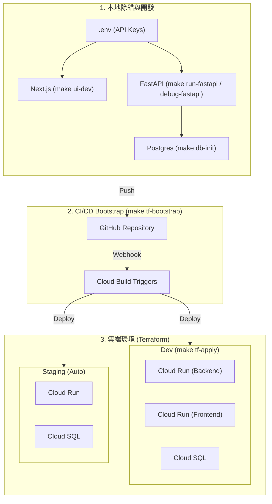

# 開發與執行指南 (Development & Execution)

本文件提供開發者在本地端及各環境下執行、部署與除錯專案的完整指南。

## 1. 本地除錯與開發 (Debug & Local)
- **環境準備**：執行 `make install-all` 安裝所有必要的 Python 依賴。
- **後端啟動**：
  - `make run-fastapi`：啟動標準 FastAPI 伺服器（預設 Port 8080）。
  - `make debug-fastapi`：啟動具有 `debugpy` 支援的後端，方便 VS Code 中斷點偵錯。
  - `make playground`：啟動 ADK Web UI (Streamlit)，適合快速測試 Agent 工具呼叫與 Prompt。
- **前端啟動**：
  - `make ui-install` 安裝依賴。
  - `make ui-dev` 啟動 Next.js 開發伺服器。

## 2. 資料庫初始化 (Database Setup)
- **容器化資料庫**：`make db-init` 啟動 Postgres 容器。
- **資料填充**：
  - `make db-seed`：建立測試使用者與基礎資料。
  - `make db-ingest`：執行 FAQ 知識庫的向量嵌入與匯入。
- **一鍵重置**：`make db-reset` 會清除所有資料並重新執行 Init/Seed/Ingest。

## 3. 基礎設施即程式碼 (Terraform & GCP)
本專案使用環境分離的 Terraform 配置 (`deployment/terraform/{dev,staging,prod}`)。

- **配置生成**：`make tf-gen-config` 自動根據環境變數生成 `.tfbackend` 配置。
- **環境初始化**：`make tf-init ENV_NAME=dev`。
- **預覽與部署**：
  - `make tf-plan ENV_NAME=dev`
  - `make tf-apply ENV_NAME=dev`
- **雲端資料庫初始化**：`make gcp-db-setup ENV_NAME=dev` 可一鍵透過 Proxy 完成雲端 SQL 的 Schema 建立與資料填充。

## 4. CI/CD Bootstrap
- **Bootstrap 部署**：`make tf-bootstrap`。
- **功能**：自動配置 Google Cloud 與 GitHub 之間的連結、IAM 權限以及 Cloud Build 觸發器。
- **自動化管線**：
  - `pr_checks.yaml`：PR 建立時自動執行 Lint 與測試。
  - `staging.yaml`：合併至 `main` 時自動部署至 Staging 環境。
  - `deploy-to-prod.yaml`：打上版本標籤 (Tag) 時觸發生產環境部署。

## 5. 容器化與 DevOps 實踐 (Containerization & DevOps)

本專案採用完整的容器化與基礎設施即程式碼 (IaC) 管理，以實現多環境自動化部署（CI/CD）與營運安全。

### 5.1 容器化配置 (Dockerfile.backend)
後端服務使用 `uv` 工具大幅提升依賴安裝速度，並採用 Multi-stage 構建優化 Image 大小：

```dockerfile
FROM python:3.12-slim
COPY --from=ghcr.io/astral-sh/uv:latest /uv /bin/
WORKDIR /app

# 安裝 SQLite 與關聯依賴
RUN apt-get update && apt-get install -y --no-install-recommends sqlite3 libsqlite3-dev
COPY pyproject.toml uv.lock ./

# 安裝 Python 依賴，包含 GCP 支援擴充元件
RUN uv sync --frozen --no-cache --extra gcp
COPY app/ ./app/
COPY db/ ./db/

EXPOSE 8080
CMD ["uv", "run", "uvicorn", "app.api.main:app", "--host", "0.0.0.0", "--port", "8080"]
```

### 5.2 基礎設施即程式碼與 Sidecar 模式 (Terraform)
- **Sidecar 多容器模式**：在生產/雲端環境中，我們使用 Cloud Run Sidecar 模式，將 `Backend` (FastAPI 核心) 容器與 `Toolbox` (MCP 工具伺服器) 容器部署在同一個 Cloud Run 服務中。它們共享 localhost 網絡，低延遲通訊，既保證了 MCP 工具的安全隔離，也降低了系統複雜度。
- **機密管理與 IAM**：透過 Terraform 自動管理 GCP Secret Manager 來儲存敏感的 API Keys (如 Gemini API Key)，並配置最少權限原則的 IAM Role 綁定給 Cloud Run 的 Service Account（包含 Tracing, Logging, BigQuery 寫入等權限）。

### 5.3 Cloud Build 自動化部署
在 `.cloudbuild/` 設定檔中定義了標準部署 Pipeline。每當觸發器啟動時，Cloud Build 會執行以下步驟：
1. **Build Images**：依序建置 Backend、Toolbox 與 Frontend 映像檔，並注入 `SHORT_SHA` 標籤。
2. **Push to Artifact Registry**：將建置好的 Docker 映像檔上傳至 GCP 容器映像檔庫。
3. **Terraform Apply**：以非互動式方式，根據新產生的映像檔版本 SHA 值執行 Terraform 更新，將最新的程式碼無縫更新至 Cloud Run 服務。

---

## 6. 開發與部署架構圖 (Architecture Diagram)

以下圖表展示了從本地開發到雲端測試環境的完整流程：



---

## 7. 完整指令對照指南 (Command Reference Guide)

本節彙整了 `Makefile` 中可用於不同開發階段的所有快捷指令，便於開發者快速查閱。

### 7.1 開發環境準備 (Environment Setup)

用於初始化開發環境、安裝依賴套件及環境檢查。

| 指令 | 說明 | 備註 |
| :--- | :--- | :--- |
| `make help` | 列出所有可用指令及其簡短說明 | |
| `make install` | 建立 Python 3.12 虛擬環境並安裝**核心**依賴 | 第一次設置時使用 |
| `make install-all` | 建立虛擬環境並安裝**所有**依賴 (含 dev, eval, gcp) | 推薦完整開發時使用 |
| `make sync` | 同步核心依賴 | 已有 `.venv` 時更新使用 |
| `make sync-all` | 同步所有依賴 | |
| `make env-check` | 檢查必要工具 (uv, docker, sqlite3) 與 `.env` 環境變數 | |
| `make playground` | 啟動互動式 Playground 進行測試 | |

### 7.2 資料庫管理 (Database Management)

管理本地 SQLite 資料庫與稽核日誌。

| 指令 | 說明 | 備註 |
| :--- | :--- | :--- |
| `make db-init` | 建立 SQLite 資料庫 (保險 schema + 種子資料 + 稽核 schema) | |
| `make db-reset` | 刪除並重建所有資料庫檔案 | 會清除所有現有資料 |
| `make clean-db` | 僅清除資料庫檔案 (`.db`) | |

### 7.3 本地運行與開發 (Local Development & Execution)

啟動 Agent 的各種介面或後端 API。

| 指令 | 說明 | 預設位址/埠 |
| :--- | :--- | :--- |
| `make run-web` | 以 ADK Web UI 啟動 Agent | 埠 8000 |
| `make run-api` | 以 ADK API Server 啟動 Agent | |
| `make run-cli` | 以 CLI 互動模式啟動 Agent | 終端機直接輸入 |
| `make run-fastapi` | 以 FastAPI 啟動 backend (支援熱重載) | 埠 8080 |
| `make debug-fastapi` | 啟動具備 `debugpy` 的 FastAPI backend | 供 VS Code Debug 使用 |
| `make ui-dev` | 啟動 Next.js 模擬前端 UI | 需先執行 `ui-install` |

### 7.4 測試與評估 (Testing & Evaluation)

包含單元測試以及針對 AI Agent 的評估測試 (Evals)。

| 指令 | 說明 |
| :--- | :--- |
| `make check` | 執行所有 Python 單元測試 (pytest) |
| `make test-api` | 專門執行 FastAPI API 相關測試 |
| `make eval-core` | 執行核心回歸評估 (包含 Case 1, 2, 3 及 Extended) |
| `make eval-safety` | 執行所有安全防護 (Safety) 相關評估 |
| `make eval-session-aware` | 執行所有會話狀態 (Session-aware) 相關評估 |

> **提示：** 個別案例 (如 `eval-core-case-1`) 也可單獨執行，請參閱 Makefile。

### 7.5 容器化工具 (Containerized Services)

使用 Docker Compose 啟動輔助服務 (如資料庫工具)。

| 指令 | 說明 |
| :--- | :--- |
| `make up` | 啟動所有 Toolbox 服務 (背景執行) |
| `make toolbox-up` | 啟動 Toolbox 服務 (背景執行) |
| `make down` | 停止並移除所有 Toolbox 容器 |
| `make logs` | 查看 Toolbox 容器的即時日誌 |

### 7.6 雲端部署 (Cloud Deployment)

管理 Google Cloud Platform (GCP) 資源。

#### Terraform (推薦)
| 指令 | 說明 |
| :--- | :--- |
| `make tf-init` | 初始化 Terraform (下載 Provider 與設定 Backend) |
| `make tf-plan` | 預覽 Terraform 部署計畫 |
| `make tf-apply` | 執行完整部署，建立/更新 GCP 資源 |
| `make tf-destroy` | 移除所有雲端資源 (請謹慎使用) |

#### 輔助與流量管理 (Shell Scripts)
| 指令 | 說明 |
| :--- | :--- |
| `make build-push` | 建置 Docker 映像檔並推送到 Artifact Registry |
| `make gcp-deploy` | 執行腳本化部署 (包含 Build, Push, Deploy) |
| `make gcp-traffic-list` | 查看 Cloud Run 服務流量分配版本 |
| `make gcp-rollback` | 將流量退回到上一個穩定版本 |
| `make gcp-canary` | 設定 Canary 流量 (REV=[名稱] PER=[百分比]) |

### 7.7 清理與維護 (Clean up)

| 指令 | 說明 |
| :--- | :--- |
| `make clean` | 清除 Python 快取與暫存檔 (`__pycache__`, `.pytest_cache`) |
| `make clean-sessions` | 清除 ADK 會話資料 (Session DB) |
| `make clean-all` | **完整清除**：包含快取、資料庫、Session 資料及 `.venv` |