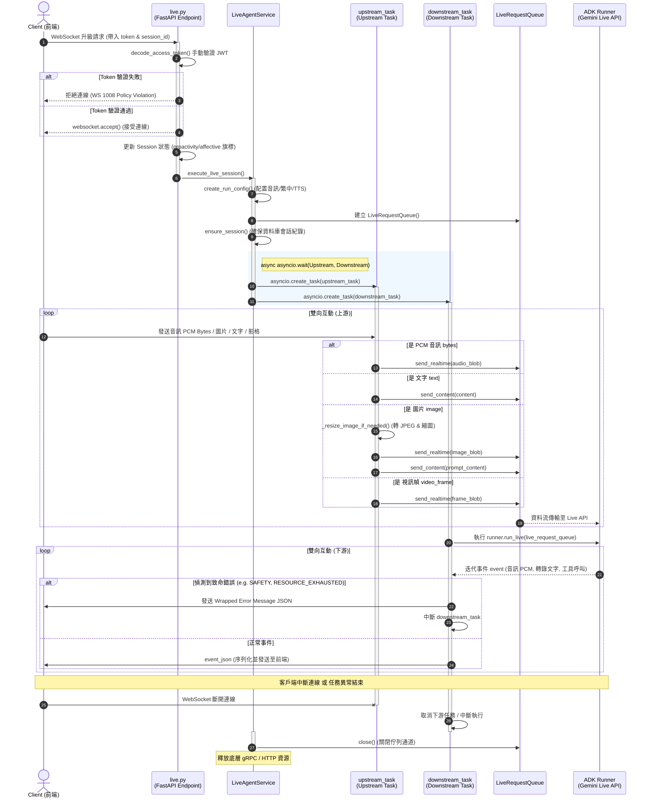

# 即時語音與 Live API 串流設計架構 (Live Streaming Architecture)

本文件整合了本專案中基於 **Google ADK (Agent Developer Kit) Multimodal Live API** 所實作的全雙工即時雙向串流（Bidi-streaming）語音對話系統。涵蓋前端音訊處理、後端非同步調度、與 Live API 的底層互動流程。

---

## 1. 完整即時互動流程說明

### 階段 1：建立連線與安全性驗證（Connection & Authentication）
1. **進入頁面與前端啟動**：
   - 使用者開啟首頁，載入主程式，並提供「開始音訊」控制按鈕。
   - 前端發起 WebSocket 升級請求至端點 `/api/agent/live/ws/{session_id}`，並將身份權杖作為 Query Parameter 帶入（因 WebSocket Header 傳輸限制，手動使用 `token` 參數帶入）。
   - 前端同時將主動建議 `proactivity` 與同理心/情感對話 `affective_dialog` 勾選狀態帶進連線 URL 參數。
2. **驗證 Token**：
   - FastAPI 路由端點 `websocket_live_endpoint()`（於 `app/api/routes/live.py`）接收連線請求後，透過 `decode_access_token` 解析並核對 JWT Token 的合法性。
   - 若驗證失敗，回傳 `WS_1008_POLICY_VIOLATION` 並拒絕連線。
3. **功能旗標儲存**：
   - 驗證成功後，連線被建立 (`websocket.accept()`)。
   - 將前端傳入的功能開關（如主動對話）寫入工作階段狀態（Session State），供後端 AI 代理程式在執行時讀取以動態調整行為風格。
4. **服務委派**：
   - 正式委派給後端 `LiveAgentService` 接管並啟動雙向串流會話。

> **WARNING:** 由於 WebSocket 無法輕易在 Header 帶入 Token，在實際部署中應確保使用 TLS/WSS 傳輸，並嚴格驗證 Query Parameter 中的 token 有效期。

### 階段 2：初始化會話與資源配置（Session Initialization & Config）
1. **建立執行配置（`RunConfig`）**：
   - 後端依模型是否為原生語音（native-audio）選擇運作模態，建立對應的 `RunConfig`：
     - 若支援原生語音，設定：`response_modalities=["AUDIO"]`（音訊回應）、`streaming_mode=StreamingMode.BIDI`（全雙工串流）。
     - 並設定語音合成（TTS）與識別（STT）語系等優化配置（預設為繁體中文 `zh-TW` 與 Puck 音調）。
2. **建置緩衝佇列（`LiveRequestQueue`）**：
   - 建立即時請求佇列 `LiveRequestQueue`，作為 WebSocket 端點與 ADK 核心 Runner 之間的並行資料安全暫存區。
3. **確保 Session 存在**：
   - 在資料庫中初始化或確認 `session_id` 存在（調用 `SessionService.ensure_session`），預防流式傳輸中發生找不到工作階段的異常。

### 階段 3：並行調度上游與下游任務（Concurrency Orchestration）
`LiveAgentService.execute_live_session` 利用 Python `asyncio` 同步啟動兩個非同步任務，並透過 `asyncio.wait(..., return_when=asyncio.FIRST_EXCEPTION)` 實作協同監控：
1. **上游任務（Client ➔ Agent）**：由 `upstream_task` 運行。
2. **下游任務（Agent ➔ Client）**：由 `downstream_task` 運行。

> **NOTE:** 採用 `return_when=asyncio.FIRST_EXCEPTION` 能夠在任何一方異常（例如前端突然斷線、網路異常或模型端中斷）時立即觸發整體清理，防止背對背任務遺留成為孤兒協程。

### 階段 4：語音與多模態上行處理（Upstream Flow - Client ➔ Agent）
#### A. 使用者啟用麥克風與「開始音訊」
1. 點擊「開始音訊」觸發事件，前端同時啟動播放與錄音的 Web Audio Worklet。
2. **播放端初始化**：採用 24k Hz 取樣率，載入播放器處理器。
3. **錄音端初始化**：採用 16k Hz 取樣率，取得麥克風權限，啟動錄音 processor。

#### B. 數據流封裝與傳送
`upstream_task` 持續監聽前端 WebSocket 所發送的輸入：
1. **PCM 二進位音訊流**：
   - 錄音 Worklet 持續抓取麥克風樣本，postMessage 回主執行緒。
   - 前端主執行緒將 Float32 格式音訊轉為 Int16 PCM，由 `audioRecorderHandler` 送出二進位 WebSoket 幀。
   - 後端 `upstream_task` 讀取 raw PCM bytes，封裝為 `types.Blob(mime_type="audio/pcm;rate=16000")`，調用 `live_request_queue.send_realtime()` 發送至緩衝佇列。
2. **Base64 多模態 JSON 幀**：
   - **文字型態 (`"text"`)**：轉為 `types.Content` 經由 `send_content()` 發送，代表完整的文字對話意圖。
   - **音訊型態 (`"audio"`)**：將前端傳入的 Base64 音訊解碼並利用 `send_realtime()` 傳送。
   - **圖片型態 (`"image"`)**：解碼 Base64 取得圖片。在發送前，會經過**影像優化處理**（`_resize_image_if_needed()`）：等比例將大圖縮小至最寬 1024 像素，轉換為 RGB 並打包為 JPEG，藉此大幅提升模型分析圖片的穩定度與網路頻寬效益。轉換為 `types.Blob` 後使用 `send_realtime()` 傳送，隨後送出文字 prompt 促使模型回覆。
   - **視訊影格 (`"video_frame"`)**：連續不斷傳送的攝像頭或螢幕共享影格，使用 `send_realtime()` 傳送。
   - **關閉型態 (`"close"`)**：通知佇列關閉並跳出迴圈。

### 階段 5：推理與語音下行處理（Downstream Flow - Agent ➔ Client）
`downstream_task` 調用 ADK 的 `runner.run_live()` 啟動執行，非同步接收並消費 Google Gemini Live API 傳回的事件流：
1. **迭代讀取事件**：
   - 不斷讀取、解析生成的事件（如文字轉錄 Transcriptions、模型音訊片段、工具呼叫等）。
2. **錯誤與終端過濾**：
   - 解析錯誤碼 `event.error_code`。若偵測到安全管制（`SAFETY`）、政策限制（`PROHIBITED_CONTENT`）、硬上限超額（`MAX_TOKENS`）或配額耗盡（`RESOURCE_EXHAUSTED`）等致命錯誤（`TERMINAL_ERROR_CODES`），會即時發送錯誤 JSON 至前端並關閉連線。
3. **數據序列化與傳送**：
   - 將合法的 ADK 事件物件序列化為 JSON（使用 `model_dump_json(exclude_none=True, by_alias=True)` 過濾多餘空欄位），並透過 WebSocket 發送給前端。
4. **前端接收與音訊播放**：
   - 前端 `onmessage` 處理事件：
     - `inputTranscription`：顯示使用者說話的即時轉錄文字。
     - `outputTranscription`：顯示模型語音轉錄的即時文字。
     - `content.parts.text`：累積成文字氣泡。
     - `content.parts.inlineData(audio/pcm)`：將音訊 Base64 轉為 ArrayBuffer，送至播放 Worklet。播放器寫入 Ring Buffer 穩定輸出。
     - 若使用者中斷對話，前端發送 `endOfAudio` 指令清空播放緩衝。

### 階段 6：連線關閉與資源回收（Disconnection & Cleanup）
1. **正常結束**：
   - 收到 `turnComplete` 時，前端移除 typing 狀態並重置訊息指標。若斷線會於 5 秒後自動重連。
2. **資源釋放**：
   - 當前端斷線、任務結束或發生非預期例外時，`LiveAgentService` 的 `finally` 區塊保證會執行 `live_request_queue.close()`，釋放底層 HTTP/gRPC 及網絡 Socket 資源，保障伺服器高併發下的健全度。

---

## 2. 完整呼叫時序圖 (Call Sequence Diagram)

以下為完整的非同步呼叫與媒體流時序圖：

---

## 3. 程式碼關聯與架構亮點

1. **核心橋樑 (`SessionService` & `AppRuntimeConfig`)**：
   - 連線時攜帶的 `proactivity` 與 `affective_dialog` 等開關，會無縫透過 `SessionService` 儲存於 SQLite 狀態中。ADK Agent 載入時會自動讀取，藉此改變 Prompt 推薦風格與主動發話邏輯，兼顧靈活性與輕量化。
2. **多模態影像智能縮放 (`_resize_image_if_needed`)**：
   - 對於前端傳送的高解析度攝像頭畫面或螢幕截圖，後端內建影像自動優化機制，可在不遺失關鍵保單視覺特徵的情況下降低模型端處理延遲，極大提昇了影像多模態分析的穩定度（避免模型端發生維度與多模態配置溢出的錯誤）。
3. **非同步協同取消機制 (`FIRST_EXCEPTION`)**：
   - 採用 `asyncio.wait` 的 `FIRST_EXCEPTION` 模式。不論是前端主動斷開（上游結束）、或者是 Google GenAI 端拋出權益超限（下游結束），任何一方發生異常，整個並行工作組都會立即中斷並執行清理工作。
4. **健全的資源閉包釋放 (`finally`)**：
   - 無論結束路徑為何，`finally` 區塊保證執行 `live_request_queue.close()` 關閉底層 gRPC/HTTP 雙向通道，避免產生孤兒 Socket 或記憶體洩漏，保證伺服器記憶體無洩漏，維持後端服務的高可靠度。
