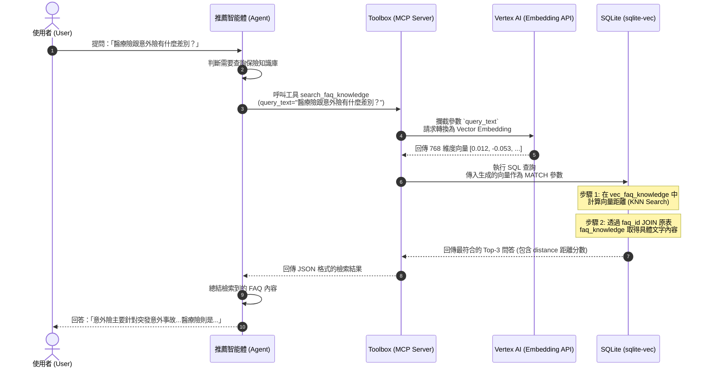

# MCP Toolboxs (Model Context Protocol Toolboxs)

本專案利用 MCP (Model Context Protocol) 概念，將核心業務邏輯封裝為標準化工具。這些工具定義於 `db/tools.local.yaml` (本地) 與 `db/tools.cloud.yaml` (雲端)，由 `app/agent.py` 中的 `ToolboxToolset` 統一管理。

## 1. 保險商品檢索工具 (Product Search)
這些工具直接與 PostgreSQL 互動，根據使用者屬性推薦適當產品：
- **`search_medical_products`**：根據年齡與年度預算搜尋醫療險。
- **`search_accident_products`**：搜尋意外險。
- **`search_family_protection_products`**：搜尋壽險等家庭保障產品。
- **`search_income_protection_products`**：搜尋重大疾病險與收入保障產品。

## 2. 知識庫與 FAQ 工具 (Semantic Search)
- **`search_faq` (或語意搜尋工具)**：
  - **技術**：結合 Vertex AI `text-embedding-004` (或 `gemini-embedding-001`) 與 SQLite 向量擴充套件 (`sqlite-vec`) 或 PostgreSQL `pgvector`。
  - **功能**：對保險條款、常見問題進行語義搜尋，而非單純關鍵字比對。
  - **限制**：每次回傳最相關的前 3 筆結果。

### 2.1 知識庫資料庫結構 (Table Schema)
FAQ 知識庫在底層主要透過兩個資料表實現關聯：

#### `faq_knowledge` (原始知識表)
儲存 FAQ 的實際文字內容與分類標籤。

| 欄位名稱 | 資料型別 | 說明 |
| :--- | :--- | :--- |
| `faq_id` | `INTEGER PRIMARY KEY` | 唯一識別碼 |
| `question` | `TEXT NOT NULL` | FAQ 問題內容 |
| `answer` | `TEXT NOT NULL` | FAQ 答案內容 |
| `related_product_type` | `TEXT` | 關聯的保險商品類型 (如 `medical`, `life` 等) |
| `audience_tag` | `TEXT` | 目標客群標籤 (如 `family`, `general` 等) |

#### `vec_faq_knowledge` (向量虛擬表)
基於向量擴充套件建立的虛擬表，專門用於高效率的語意相似度檢索（KNN 搜尋）。

| 欄位名稱 | 資料型別 | 說明 |
| :--- | :--- | :--- |
| `faq_id` | `INTEGER PRIMARY KEY` | 關聯至 `faq_knowledge` 的識別碼 |
| `embedding` | `FLOAT[768]` | 長度為 768 維的浮點數向量，存放對應 FAQ 內容的 Embedding |

---

### 2.2 檢索工具配置 (MCP Tool Design)
在 `db/tools.yaml` 中定義供 Agent 呼叫的 MCP 工具 `search_faq_knowledge`。此工具自動將使用者的自然語言查詢轉換為向量，並執行 SQL 的 `MATCH` 語法進行語意檢索：

```yaml
kind: tool
name: search_faq_knowledge
type: sqlite-sql
source: insurance_sqlite
description: Semantic search for insurance FAQ and terms explanation.
parameters:
  - name: query_text
    type: string
    description: User query or term to explain.
    # 指定此參數在帶入 SQL 前，需先透過 Vertex Embedding 模型轉換為向量
    embeddedBy: vertex_embedding
statement: |
  WITH vector_search AS (
    SELECT
      faq_id,
      distance
    FROM vec_faq_knowledge
    WHERE embedding MATCH ?  -- 這裡的 ? 會自動代入 query_text 轉換後的向量
    ORDER BY distance
    LIMIT 3
  )
  SELECT
    f.question,
    f.answer,
    v.distance,
    f.related_product_type
  FROM faq_knowledge f
  JOIN vector_search v ON f.faq_id = v.faq_id
  ORDER BY v.distance ASC;
```

---

### 2.3 使用者查詢檢索完整流程圖

以下展示了使用者發起詢問到 Agent 透過向量檢索回覆結果的完整時序：



---

## 3. 資料查詢與規則工具 (Data & Rules)
- **`get_product_detail`**：根據 `product_id` 獲取單一產品的完整詳細資訊（包含除外責任、等待期）。
- **`get_product_by_name`**：根據產品名稱精確查詢。
- **`get_recommendation_rules`**：獲取特定產品類型的推薦邏輯基準，供 Agent 作為決策參考。

## 4. 向量嵌入 (Embedding)
- **模型**：使用 `vertex_embedding` (主要採 `text-embedding-004` 或 `gemini-embedding-001` 模型)。
- **維度**：768 維。
- **應用**：在 FAQ 檢索中將使用者的自然語言查詢轉換為向量，計算距離（如 Cosine Distance）進行相似度比對。

## 5. 工具箱配置 (Toolset Configuration)
工具被組織成不同的 `toolset`，以便在不同場景下載入：
- **`insurance_recommendation_tools`**：包含所有搜尋與查詢工具，用於正式推薦流程。
- **`insurance_debug_tools`**：精簡版工具集，用於偵錯與基礎問答。

## 6. 自動化腳本
- **`scripts/ingest_faq_embeddings.py`**：將 `db/seed.sql`（或 `faq_knowledge`）中的 FAQ 資料進行向量化，呼叫 Vertex AI Embedding API 產生 768 維度向量，並匯入 SQLite 的 `vec_faq_knowledge` 表。
  - **核心邏輯**：
    1. 建立包含 `sqlite-vec` 支援的資料庫連線。
    2. 組合問答文本：`Question: {question}\nAnswer: {answer}`。
    3. 呼叫 Vertex AI 取得 768 維的 embedding 陣列。
    4. 將轉換後的向量以 JSON 格式存入 `vec_faq_knowledge` 表。
- **`scripts/seed_user.py`**：初始化測試使用者帳號與模擬權限。